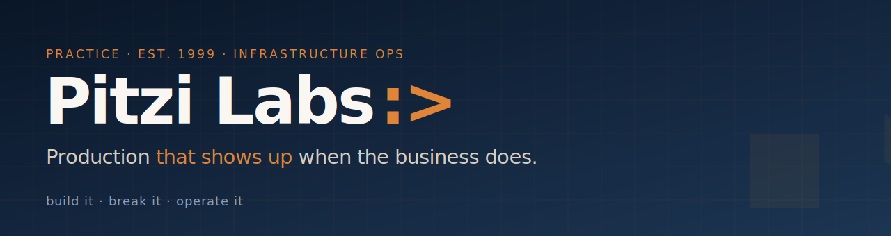

  

  <strong>Infrastructure operations consulting.</strong> Twenty-five years of bare-metal data centers,
  24×7 ops, and single-homed environments — now bridging into cloud-native by building it, breaking it,
  and operating it.

---

## What I do

Four things, done well. No frameworks, no decks, no "digital transformation" — just infrastructure you can read, run, and hand off.

| | Service | |
|---|---|---|
| `01` | **Platform engineering** | Greenfield AWS / GCP / Azure builds. Terraform-managed, multi-AZ, least-privilege, observable from day one. A platform, not a single-app deployment. |
| `02` | **Cost & posture audits** | Find the NAT gateway eating the budget, the IAM role nobody owns, the bucket with 40 TB of forgotten logs. One-page report, no theatre. |
| `03` | **Incident & on-call** | Runbooks, alarms, and rotations humans can live with. Pager hygiene included. SLOs that reflect reality, not aspiration. |
| `04` | **CI/CD & supply chain** | OIDC, signed images, plan-on-PR, apply-on-merge. No long-lived credentials anywhere. |

## Selected work

The repos below are public and real — running infrastructure and tools, not portfolio props.

| Repo | What it is |
|---|---|
| [**foundry-platform-demo**](https://github.com/PitziLabs/foundry-platform-demo) | Reference three-tier AWS platform, 100% Terraform — multi-AZ VPC, ECS Fargate behind an ALB (ACM / Route 53), RDS + ElastiCache, WAFv2, KMS, least-privilege IAM, CloudWatch/CloudTrail/Config + budget guardrails. |
| [**ice-cream-book**](https://github.com/PitziLabs/ice-cream-book) | A real app on that platform — live at [icecreamtofightwith.com](https://icecreamtofightwith.com), deployed via GitHub OIDC → ECR / ECS / ALB. Under real load, paying real bills. |
| [**homelab-observability**](https://github.com/PitziLabs/homelab-observability) | Git-driven, fully declarative observability for a home network — one Grafana Alloy container ships metrics + logs to Grafana Cloud, with Terraform-provisioned dashboards and alerts. |
| [**firewalla-axiom-pipeline**](https://github.com/PitziLabs/firewalla-axiom-pipeline) | Self-hosted security-log pipeline: Zeek DNS / flow / TLS logs from a Firewalla to Axiom via Fluent Bit. 30-day searchable history at zero recurring cost. |
| [**homeassistant-config**](https://github.com/PitziLabs/homeassistant-config) | A production residential smart home — 40+ entities managed declaratively in YAML, gitops-deployed, with two purpose-built dashboards. |
| [**reference-checker**](https://github.com/PitziLabs/reference-checker) | Forensic reference-integrity auditor for academic publishing — prompt-engineered deep-scan citation verification on Claude with live web search. |
| [**workstation-bootstrap**](https://github.com/PitziLabs/workstation-bootstrap) | Single-command bootstrap that turns a fresh Linux box into a fully configured cloud-infrastructure dev workstation, across four variants. |
| [**shared-workflows**](https://github.com/PitziLabs/shared-workflows) | Reusable GitHub Actions and fleet-wide CI policy shared across every PitziLabs repo. |

## How I think about production

- **Build it, break it, operate it** — the person who designs the system carries the pager for it.
- **Blast radius over blast capacity** — least-privilege is the default, not a checkbox.
- **Runbooks beat heroics** — write the doc; update it when it lies.
- **Observable from day one** — you cannot operate what you cannot see.
- **Plan on PR, apply on merge** — the pipeline is the contract.
- **Cost is a posture** — a NAT gateway you forgot about is a security problem.

## Get in touch

- **Email** — `chris@pitzilabs.dev`
- **GitHub** — [github.com/PitziLabs](https://github.com/PitziLabs)
- **Live demo** — [icecreamtofightwith.com](https://icecreamtofightwith.com) · the practice site lands at **pitzilabs.dev** soon

This profile and the PitziLabs repos are built in collaboration with <a href="https://claude.ai">Claude</a> (Anthropic): I direct the work and review the output, Claude writes much of the code. I'm an infrastructure operator, not a software engineer — please read the repos as working infrastructure, not as a portfolio of coding ability.
