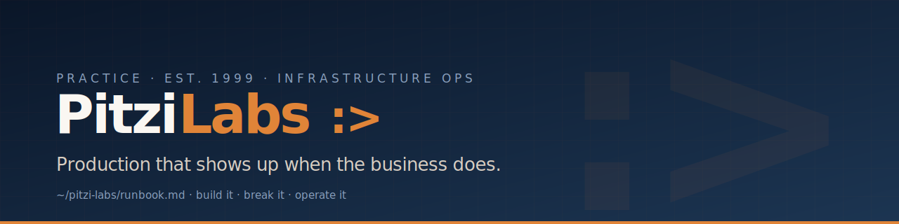

**Keeping production up — bare metal through cloud-native, and every platform shift in between. We build it, break it, and operate it.**

📖 &nbsp;The full runbook lives at **[lentago.dev](https://lentago.dev)** →

 

### ☁️ &nbsp; Cloud & containers

### 🖥️ &nbsp; Bare metal & virtualization

### 🏗️ &nbsp; Infrastructure as code

### 🔁 &nbsp; CI/CD & supply chain

### 📟 &nbsp; Observability & on-call

 

| What we do | |
| :-- | :-- |
| **Platform engineering** | Greenfield builds, Terraform-managed, observable from day one. |
| **Cost & posture audits** | One-page report, no theatre. |
| **Incident & on-call** | Runbooks and rotations humans can actually live with. |
| **CI/CD & supply chain** | OIDC, plan-on-PR, no long-lived credentials. |
| **AI-augmented delivery** | A Claude agent fleet that builds and reviews — directed by humans, who own every merge. |

<b>chris@lentago.dev</b> &nbsp;·&nbsp; New England, US &nbsp;·&nbsp; remote · async-friendly

